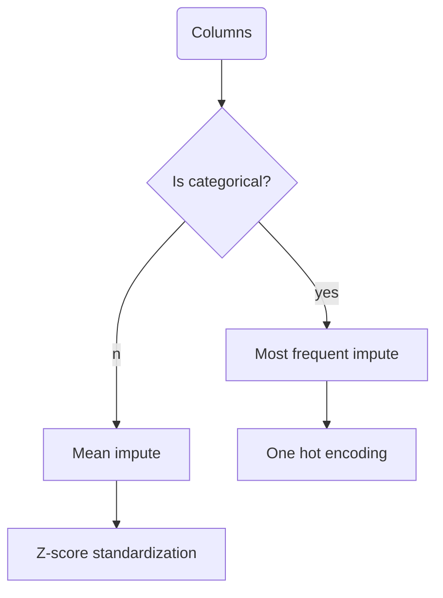

# Overview
Introducing SuperPlug AutoML, your straightforward solution for hassle-free supervised machine learning in Python. This plug-and-play gem requires only NumPy, eliminating unnecessary dependencies and complexities. Welcome to the simplicity of SuperPlug AutoML—where building accurate models has never been easier.


### The pipeline for each column features


 ### The pipeline for each models
 ```mermaid
 graph TD;
	 A(Models) --> Z[Train test split]--> B{Have hyperparameter?}
	 B -- no --> C[Fit] --> D[Evaluate]
	 B -- yes--> E[Randomized search cv]
	 E --> F[Fit] --> G[Evaluate]