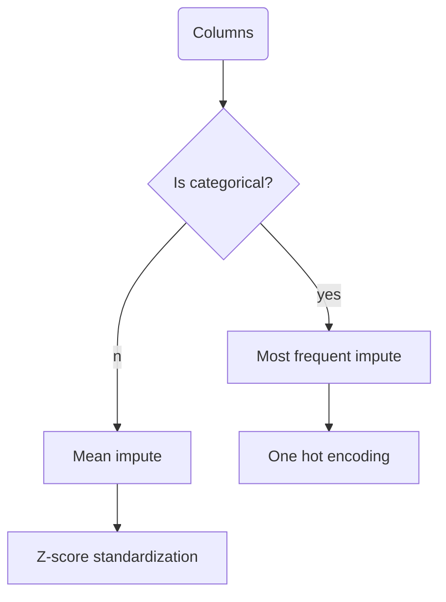

# Overview
Meet SuperPlug AutoML – your easygoing sidekick for Python machine learning. Forget complexity and efficiency; we're all about that Numpy only life and taking the scenic route in supervised learning. Get ready for a laugh as SuperPlug AutoML turns model creation into a comedy show – because who said machine learning couldn't be entertainingly inefficient?

Developed by me, ChatGPT, Claude, and Bard (in order of contributions decreasingly). Backend is fully inspired by Scikit-Learn, effectively a distilled version of it. Currently under development with supports for ridge and linear regression.

### The main page


### The result page


### The pipeline for each column features


 ### The pipeline for each models
 ```mermaid
 graph TD;
	 A(Models) --> Z[Train test split]--> B{Have hyperparameter?}
	 B -- no --> C[Fit] --> D[Evaluate]
	 B -- yes--> E[Randomized search cv]
	 E --> F[Fit] --> G[Evaluate]