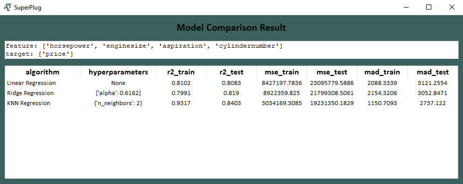
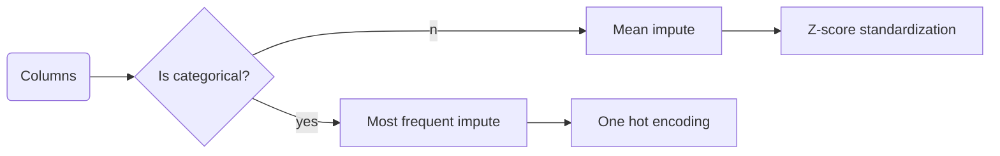

# Overview
Meet SuperPlug AutoML – your lazy-but-trying sidekick for traditional supervised learning. Just throw in your features and target like you're ordering takeout, and it'll give it a go; it might be a decent job, or it might just shrug and say, "¯_(ツ)_/¯."

Who said Python can't do squat without a massive entourage of dependencies? Forget the obsession in complexity and efficiency; we're living the NumPy-only life and taking the scenic route in supervised learning.

### Technical overview
Developed by me, ChatGPT, Claude, and Bard (in order of contributions decreasingly) mainly to serve as a baseline comparison to improve upon. Backend is inspired by Scikit-Learn, effectively a distilled version of it. Currently under development with supports for ridge and linear regression.

### The main page


### The result page


## AutoML pipeline
SuperPlug seeks to abstract away many of the model creation pipeline. Here lies the breakdown of what it does under the hood.

### The preprocessing pipeline for each column features


 ### The training pipeline for each models
 ```mermaid
 graph LR;
   A(Models) --> X{Is classification?}
   X --yes--> W[Stratified train test split]
   X --no-->Z[Train test split]
   Z --> B{Have hyperparameter?}
   W --> B
   B -- no --> C[Fit] --> D[Evaluate]
   B -- yes--> E[Randomized search cv]
   E --> C
```

### TODO (in order of importance)
- Refactor the ResultWindow class (currently quite hideous)
  - Refactor how all_data is getting passed (currently quite chaotic)
  - Just refactor in general (polishing)
- Finish the docs and comments
- Add more algorithms for regression
- Finish the readme
- Add support for classification and its algorithms
  - Figure out what needs to change to do so
  - Add appropriate metrics and introduce flexibility for evaluation and scoring
  - Modify the train test split to support stratification
- Add support for PCA
- Make the result window more informative
  - Figure out what other options to add
