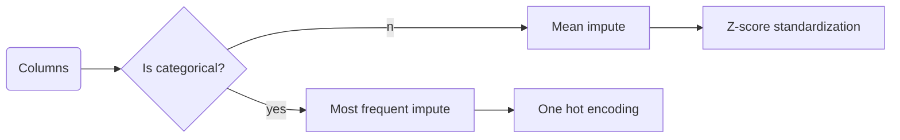

# Overview

Introducing SuperPlug AutoML – your intuitive no-code-solution for training traditional supervised algorithm, meticulously brought to life by the coding prowess of ChatGPT, Claude, Bard, and me. Positioned as a baseline model comparison tool, this collaboration champions simplicity without compromising efficiency (well at least not that much :p). 

*Currently under development with supports for ridge and linear regression.*

# Main Features

#### Simple
Just throw in your csv file, specify the feature(s) and target, and it'll give it a go.

#### Lightweight 
With a NumPy-only approach, SuperPlug AutoML defies the belief that Python requires an entourage of dependencies for robust machine learning. The backend is proprietary and inspired by Scikit-Learn, effectively a distilled version of it. 

#### Flexible Backend and Dependency
While the main backend is custom-made, the API allows for seamless backend switch to Scikit-Learn (just uncomment the imports in api.py) if you want more runtime efficiency at the expense of additional dependency.

# The main page


# The result page


# AutoML pipeline
SuperPlug seeks to abstract away many of the model creation pipeline. Here lies the breakdown of what it does under the hood.

#### The preprocessing pipeline for each column features


 #### The training pipeline for each models
 ```mermaid
 graph LR;
   A(Models) --> X{Is classification?}
   X --yes--> W[Stratified train test split]
   X --no-->Z[Train test split]
   Z --> B{Have hyperparameter?}
   W --> B
   B -- no --> C[Fit] --> D[Evaluate]
   B -- yes--> E[Randomized search cv]
   E --> C
```

# TODO (in order of importance)
- Refactor the ResultWindow class (currently quite hideous)
  - Refactor how all_data is getting passed (currently quite chaotic)
  - Just refactor in general (polishing)
- Finish the docs and comments
- Add more algorithms for regression
- Finish the readme
- Add support for classification and its algorithms
  - Figure out what needs to change to do so
  - Add appropriate metrics and introduce flexibility for evaluation and scoring
  - Modify the train test split to support stratification
- Add support for PCA
- Make the result window more informative
  - Figure out what other options to add
