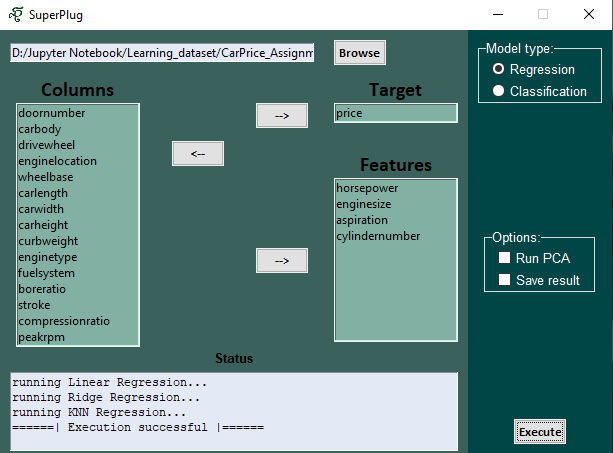

# Overview
Introducing SuperPlug AutoML, your straightforward solution for hassle-free supervised machine learning in Python. This plug-and-play gem requires only NumPy, eliminating unnecessary dependencies and complexities. Streamline your model creation process with an intuitive Python experience tailored specifically for supervised learning. Welcome to the simplicity of SuperPlug AutoML—where building accurate models has never been easier.

